# cursor-token-saver

**为 Cursor 的 agent 补上认知层（Cognitive Layer）**：一端用内容寻址证据库把 token 消耗压到最低——无损、可精确恢复；另一端用可验证语义记忆、项目世界模型和技能 Runbook，让 agent 跨会话持续积累对项目的理解。LLM 本身无状态，这套系统让它在你的项目里**有状态**。全部本地运行，零遥测。

核心设计原则：**只延迟传输，不永久删除信息**。源码片段和完整命令日志都变成带稳定证据 ID 的本地内容；默认只给模型最小预览，需要时通过 `context_expand` 精确恢复。所有预算都是软预算，所有拦截可重试放行，全部 hook 默认 fail-open。

## 概念与原理

token 浪费和跨会话失忆是同一个问题的两面：LLM 无状态，每次请求都要重传全部上下文，会话结束一切归零。本工具从两个方向同时解决——

**省的一侧：内容寻址证据库（Content-Addressed Evidence Store）**
所有被截断/压缩/差分的内容按内容哈希落盘，生成稳定证据 ID。默认只给模型最小首屏（大纲、差分、结构画像），需要时按 ID 精确恢复任意行区间。省掉的是"默认全量传输"这个浪费，信息零丢失。

**记的一侧：三层记忆结构（对应认知科学的陈述性/程序性记忆分层）**

| 层 | 记什么 | 来源 |
| --- | --- | --- |
| 语义记忆（事实层） | 约定、决策、坑、入口 | agent 显式保存 + checkpoint 决策机械提取 |
| 世界模型（关系层） | `实体 --关系--> 实体` 三元组：域名→端口→服务→脚本 | 自动扫描 package.json / docker-compose / nginx / .env / CI |
| 技能记忆（程序层） | 可复用 Runbook：目标 + 成功命令序列 | 任务收尾从命令时间线机械提取；失败→修复过程挖掘成"坑" |

**可信的关键：可验证性（Verifiable Memory）**
记忆挂证据哈希——文件一变自动标 STALE；机械提取只生成候选（candidate），agent 或人确认后才生效；长期未用自动归档，复发提升置信度。这套机制防止"记忆幻觉"污染后续会话："存了就信"的记忆系统迟早变成负资产。

**闭环：感知 → 记忆 → 回忆 → 行动 → 反馈 → 学习**
hooks 观测每次文件读取和命令执行（感知），沉淀为可验证记忆（学习），代码检索自动融合相关记忆（回忆），bootstrap 热启动包让新会话用几百 token 恢复全部任务状态（延续）。结果是：agent 在你的项目里**越用越便宜、越用越懂**。

### 运行原理图

```mermaid
flowchart LR
    A["🤖 Cursor Agent<br/>无状态 LLM<br/><i>读文件 · 跑命令 · 改代码</i>"]

    subgraph P["① 感知层 · Hooks（fail-open）"]
        direction TB
        RG["read-guard<br/><i>拦超大读 · 增量重读</i>"]
        SG["shell-guard<br/><i>日志治理 · 输出差分</i>"]
        EI["edit-invalidate<br/><i>编辑追踪</i>"]
        SA["shell-audit<br/><i>退出码 · 失败观测</i>"]
        ST["session-track<br/><i>会话生命周期 · 自动扫描</i>"]
    end

    subgraph M["② 认知层 · 三层可验证记忆"]
        direction TB
        SEM["语义记忆 · 事实层<br/><i>约定 / 决策 / 坑 / 入口</i>"]
        WM["世界模型 · 关系层<br/><i>实体 —关系→ 实体 三元组</i>"]
        SK["技能 Runbook · 程序层<br/><i>目标 + 成功命令序列</i>"]
        GOV["治理：候选→确认 · STALE 检测 · 衰减/置信度<br/><i>机器不伪造 · 不自我确认</i>"]
    end

    subgraph E["③ 证据层 · 内容寻址存储"]
        EV["src_/art_ 稳定证据 ID（内容哈希）<br/>无损差分 · 全量 artifact 落盘<br/><i>只延迟传输 · 不删除信息</i>"]
    end

    subgraph R["④ 回忆层 · 统一查询（MCP）"]
        direction TB
        CQ["context_query<br/><i>检索融合：代码 + 记忆</i>"]
        WQ["mode=world<br/><i>实体关系子图（1-2 跳）</i>"]
        BS["bootstrap<br/><i>热启动包：几百 token 续任务</i>"]
        CE["context_expand<br/><i>按 ID 无损恢复原文</i>"]
    end

    DB["📊 全局面板<br/><i>记忆审阅 · 浪费洞察 · 省钱统计 · 基准测试</i>"]

    A -->|"感知：工具调用被观测"| P
    P -->|"机械提取：失败→修复 · Runbook · 世界扫描"| M
    P -->|"全量落盘"| E
    M -->|"挂证据哈希"| E
    M -->|"召回"| R
    E -->|"按 ID 精确恢复"| R
    R ==>|"行动：最小首屏 + 证据 ID（无损回注）"| A
    P -.->|"事件流"| DB
    M -.->|"治理"| DB
    E -.->|"度量"| DB
```



闭环：**感知 → 记忆 → 回忆 → 行动 → 反馈 → 学习**。绿色粗线是无损回注主路径——模型只收最小首屏和证据 ID，其余一切按需精确恢复。

## 快速开始

```bash
# 在你的项目根目录执行
npx cursor-token-saver init                 # 安装（默认 standard 档）
npx cursor-token-saver init --profile extreme   # 极致档

npx cursor-token-saver dashboard            # 全局面板 http://localhost:4517（所有项目）
npx cursor-token-saver report --all         # 终端看全局汇总
npx cursor-token-saver report               # 终端看当前项目统计
npx cursor-token-saver index                # 可选：预建语义搜索的神经嵌入索引
npx cursor-token-saver eval --limit 50      # 可选：离线检索质量评测
npx cursor-token-saver daemon               # 可选：手动启动全局模型服务（通常自动启动）
npx cursor-token-saver start-all            # 重启电脑后，一键后台启动全部常驻服务
```

安装后 Cursor 自动加载 hooks（设置 → Hooks 可确认；无效则重启 Cursor）。要求 Node >= 18 且在 PATH 中。

## 它拦什么

| Hook | 事件 | 行为 |
| --- | --- | --- |
| read-guard | preToolUse (Read) | 超过行数上限的全量读 → 拦截并告知行数与建议读法；短时间重复读未修改文件 → 拦截并指路；**文件变化后的重读只传无损行差分**（旧内容 + diff = 新内容，全文快照可按 ID 回取）。**防锁死兜底：被拦后 agent 立即重试同一文件即强制放行**（略超上限 25% 以内直接放行，避免临界摩擦） |
| file-blocklist | beforeReadFile | 拦截锁文件、构建产物、压缩产物、超大数据文件（数据文件指向 `context_query mode=profile` 结构画像）。**用户主动 @ 附加的文件放行** |
| shell-guard | preToolUse (Shell) | 白名单内的高噪音命令完整保存为本地 artifact；Jest/Vitest、Pytest、Cargo、Go test 和编译器日志首屏只展示失败摘要/相关堆栈；**同一命令重复运行（典型：改代码→重跑测试循环）只回与上次输出的无损差分，逐字节相同则只回一行标记**。**纯 `&&` 串联且每段都在白名单内的命令链（如 `npm run build && npm test`）整体治理**。任意省略内容可按 ID 恢复。含管道/重定向的命令不碰 |
| edit-invalidate | afterFileEdit | 文件被编辑后允许重读且保留读取快照，让重读走增量差分（防误拦；read-guard 另有 mtime 兜底） |
| shell-audit | afterShellExecution | 纯统计：记录命令输出体量，找出噪音大户 |
| mcp-audit | afterMCPExecution | 纯统计：记录其他 MCP 工具的输出体量，找出"MCP 噪音大户"（repo-map 自己的调用由服务器端记录） |
| session-track | sessionStart / stop / preCompact | 会话统计；上下文压缩时提示"开新会话更省" |

另外 init 会写入：

- `.cursor/mcp.json`：注册 repo-map MCP 服务器（见下）
- `.cursor/rules/token-saver.mdc`：一条精简的省 token 行为规则（先用 repo map / 搜索定位、压缩读取、探索交给子代理、任务收敛后建议开新会话、大任务先规划）
- `.cursorignore`：静态低价值清单（锁文件、构建产物、字体、压缩包等）+ 扫描出的超大文件，放在标记块里，不碰你自己的内容。安装后 sessionStart 每 24 小时自动重扫一次，新生成的超大数据/日志文件会自动收编进标记块

## MCP repo map（主动省：给 agent 更便宜的信息获取方式）

Hooks 是"堵"，统一上下文 MCP 是"疏"。init 会注册一个零依赖的本地 MCP 服务器（`node .cursor/hooks/token-saver/mcp-repo-map.mjs`，首次使用需在 设置 → MCP 中确认启用）。工具定义本身也是每次 LLM 请求的固定开销，所以 `tools/list` 默认只暴露 4 个统一无损工具；5 个旧兼容工具（`repo_map`/`file_outline`/`smart_search`/`semantic_search`/`read_compact`）默认隐藏但 `tools/call` 仍然接受，设 `contextQuery.legacyTools=true` 可恢复展示：

| 工具 | 作用 | 省在哪 |
| --- | --- | --- |
| `context_query` | 统一入口：`search` 同时跑精确字符串、BM25 和本地神经向量并做 RRF 融合；另有 `map`、`outline`、`callgraph`、`read`（支持 `symbol` 骨架读取）、`profile`（数据文件画像）、`diff`、`lsp`、`bootstrap` 模式 | 首屏只返回短预览和稳定证据 ID；低置信度/最近测试失败时自动扩大内部候选，不把噪音一起传给模型 |
| `context_expand` | 将证据 ID 按 `preview` / `compact` / `exact` / `full` 逐级展开，也可按正则或行区间读取完整日志 | 压缩结果永远有精确原文回退；源码改变后旧 ID 会明确报 stale，防止使用过期证据 |
| `context_checkpoint` | 保存/恢复目标、状态、修改文件、决策和未决问题 | 压缩或新会话不用重复回顾全部对话 |
| `repo_map` | 全仓符号地图：类/函数签名 + 行号，按 **import 引用图 PageRank** 排序（★ 标记核心文件，重要文件展示更多符号），支持聚焦子目录和字符预算 | 替代"读一堆文件来了解项目结构"，一次调用 ≈ 数千 token 变数百 |
| `file_outline` | 单文件完整大纲（符号 + 行号） | 先看大纲再按行区间精读，替代全量读 |
| `smart_search` | 精确紧凑搜索，只返回 `path:line: 匹配行`（优先 ripgrep，无 rg 自动降级内置扫描） | 替代为找代码而做的探索性读取 |
| `semantic_search` | 概念级搜索：**本地神经嵌入 + BM25 混合检索**（RRF 融合），"where is login handled" 这类不知道确切字符串的查询 | 替代多轮试错式 grep |
| `read_compact` | 压缩读取：去注释/空行/折叠超长字符串，保留**原始行号**并附精确证据 ID，支持 start_line/end_line | 源码文件通常再省 25–50%；注释/字面量可能重要时通过 ID 无损展开 |

符号提取是零依赖的正则方案，覆盖 JS/TS/Python/Go/Rust/Java/Kotlin/Swift/C#/Ruby/PHP/C/C++。`callgraph` 是基于 import/引用正则的近似图，会明确标注置信边界，不冒充编译器级调用图。每份查询证据记录在 `.cursor/token-saver/context-store/manifest.json`；源码只保存路径、区间、stamp 和 SHA-256，完整日志才写入 `blobs/`。

### 无损去重、软预算和日志 artifact

- 同一 conversation 已传输且未变化的内容只返回 `already_sent` + ID；文件改变后生成新 ID。
- **只读工具结果去重**：相同参数的 `repo_map`/`file_outline` 等在 10 分钟内（`contextQuery.toolDedupeMs` 可调）产出逐字节相同结果时，只回一行"结果未变"标记 + artifact ID，任何会话都能按 ID 无损回取完整结果。`context_expand`/`context_checkpoint` 永不去重。
- **新会话热启动包**：`context_query {"mode":"bootstrap"}` 用几百 token 返回最近检查点、Git 改动文件、最近失败命令和最近证据 ID——接续任务的新会话不必重新探索。48 小时内有检查点时 sessionStart 会自动提示。
- **符号级骨架读取**：`context_query {"mode":"read","file":"...","symbol":"..."}` 返回目标函数/类的完整内容，文件其余部分折叠成"一行一个符号"的骨架——比全量读省 60–80%，且任意区间可再展开。
- **数据文件画像**：`context_query {"mode":"profile","file":"..."}` 对 JSON/JSONL/CSV/TSV/YAML 返回结构概览（键/类型/行数/样本）+ 证据 ID，具体记录按正则/行区间精确回取。大 JSON 从数十万 token 变几百 token。
- 工具输出会累计到会话软预算。达到提醒比例后只缩小后续**首屏**——`context_query` 字符预算减半、被治理命令的头尾行数减半——`context_expand exact/full` 永远不受限制。
- 高噪音命令的完整 stdout/stderr 保存在 context-store artifact；默认保留 7 天、最多 512MB，sessionStart 自动做 TTL/LRU 清理。
- `preCompact`、文件编辑和 stop 会维护确定性机械检查点；Agent 可用 `context_checkpoint` 补充真正的语义决策，工具不会伪造摘要。
- 配置位于 `contextQuery`、`artifactStore`、`taskBudget` 三段；全局面板的“上下文”页可查看证据、artifact、预算和检查点统计。

### 项目语义记忆（跨会话不再重复探索）

新会话最大的隐性浪费是重新学习同样的工程事实。记忆系统把它们沉淀下来：

- **写入**：agent 用 `memory_save` 保存约定/决策/坑/入口（可挂关联文件）；四条机械提取通道只生成**候选**、确认后才生效——`context_checkpoint` 的 decisions、**失败→修复**（同一命令从失败转成功且期间有文件编辑时，自动记录"命令 X 失败，改 A、B 后通过"）、**runbook**（checkpoint 标记任务完成时，从时间线里 exit 0 的命令序列提取可复用技能，复发提升置信度）、**世界模型扫描**（24h 节流扫 package.json / docker-compose / nginx / .env / CI，提取"实体 --关系--> 实体"三元组）。机器不伪造、不自我确认。
- **召回**：`context_query {"mode":"memory","query":"..."}` 按相关性检索（英文按词、中文按 bigram）；`{"mode":"world","query":"9501"}` 按实体走关系子图（一到两跳，一行三元组顶几百行配置）；`bootstrap` 热启动包自动带 top 条目；`mode=search` 的代码检索结果会自动附带高相关记忆（检索融合，零额外调用）。
- **可验证**：挂了文件的记忆存文件哈希，文件变化后召回时明确标注 `STALE`，`memory_save action=confirm` 按当前内容重新确认——防"记忆幻觉"污染后续会话。
- **整合**：`memory_save action=merge ids=[...] text="..."` 让 agent 把多条相关记忆合并成一条精炼版；原条目归档并记录 `mergedInto` 溯源。
- **作用域**：默认项目级；`scope=global` 存到 `~/.cursor-token-saver/`，跨项目召回（适合个人通用偏好），全局记忆不挂文件、不会 stale。
- **治理**：相似条目自动合并；长期未召回的自动归档（可恢复，非删除）；候选 14 天未确认过期；总量封顶。面板"记忆"页含效果度量（生效/候选数、累计召回、从未召回、过期待确认、关系/技能数与技能复用），可查看/确认/编辑/归档/恢复/删除。
- 配置在 `memory` 段（`enabled`/`maxActive`/`decayDays`/`bootstrapMax`）。

### Diff、LSP、测试选择和离线评测

- `context_query {"mode":"diff"}` 把完整 Git patch 保存为 artifact，首屏只返回改动文件、hunk 和当前源码证据 ID；非 Git 项目明确回退普通 map/search。
- `context_query {"mode":"lsp","file":"...","symbol":"..."}` 按需调用本机已有的 `typescript-language-server`、`pyright-langserver`、`rust-analyzer` 或 `gopls` 获取 references/definition。默认 1.5 秒超时并熔断；缺失或失败立即回退现有 import/精确文本图。
- `test_select {"phase":"iterate"}` 根据 Git 改动、直接命名和反向 import 选择相关测试；低置信度直接返回全量命令，相关测试失败时给出全量 fallback。最终交付前调用 `phase=final`，它永远返回完整测试套件。
- 索引发生实际构建或增量刷新后，会自动计划离线评测：默认延迟 2 分钟、后台低优先级执行、每项目最多 24 小时一次，并用跨进程锁防止重复。MCP 中途退出会在下次启动恢复计划；失败只写状态，不影响检索。
- `cursor-token-saver eval --dir . --limit 50` 仍可手动立即评测。它从真实符号构造 query→expected-file 数据集，输出 Hit@1、Hit@5、MRR 到 `.cursor/token-saver/eval-report.json`。
- 自动评测配置位于 `embedding.autoEval`、`embedding.autoEvalIntervalHours`、`embedding.autoEvalLimit`，面板可直接修改并查看计划/运行/失败状态。

### 全局索引服务

神经嵌入默认连接 `127.0.0.1:4518` 的全局守护进程，所有项目共享一个模型实例，项目向量索引仍分别保存在各自目录。首次检索会自动启动；连接、启动或推理失败时立即回退项目内 transformers → Ollama → BM25，不影响能力。也可手动运行：

```bash
cursor-token-saver daemon --port 4518
```

配置：`embedding.useGlobalDaemon=false` 可关闭，`embedding.daemonPort` 可改端口。服务仅监听 loopback，源码不会上传。

### 重启电脑后一键启动

在源码目录双击 `start-all.command`，或在终端运行：

```bash
./start-all.sh
# 全局安装后也可以：
cursor-token-saver start-all
```

命令会幂等启动全局面板（前端由它托管，端口 4517）和全局索引服务（端口 4518），已运行的服务不会重复启动。日志位于 `~/.cursor-token-saver/logs/`。项目级 MCP 不需要加入脚本，它由 Cursor 打开项目时自动启动。

### 语义搜索（神经嵌入）

`semantic_search` 使用完全本地的神经嵌入（transformers.js + ONNX），代码不出机器。默认模型为多语言版 `Xenova/paraphrase-multilingual-MiniLM-L12-v2`（量化后约 120MB，中文/英文查询都可用）；只用英文的话可在配置里换 `Xenova/all-MiniLM-L6-v2`（约 23MB）：

- **索引**：按符号边界分块（每块 ≤60 行），向量 Int8 量化后存 `.cursor/token-saver/embed-index.json`，按 mtime 增量更新——改了哪个文件只重嵌哪个
- **模型缓存**：`~/.cursor-token-saver/models/`，所有项目共享，只下载一次；国内网络可 `HF_ENDPOINT=https://hf-mirror.com` 走镜像
- **全自动**：MCP 服务器（随 Cursor 打开项目常驻）启动约 45 秒后自动建索引，之后每 5 分钟做一次廉价的过期检查（只 stat 文件），有变化才增量重嵌，**无需手动跑 `index`**；`semantic_search` 被调用时也会顺带即时刷新。`cursor-token-saver index` 仍可用于手动预建。不想让某个项目自动建索引，配置里设 `"embedding": { "autoIndex": false }`
- **降级链**：transformers.js →（不可用时）Ollama（`nomic-embed-text`）→ BM25，永不报废
- **配置**：`.cursor/token-saver.json` 里的 `embedding` 段：`{ "backend": "auto|transformers|ollama|off", "model": "...", "ollamaModel": "..." }`

注意：复制进项目的脚本本身仍是零依赖；神经嵌入依赖存在于安装包里（init 会把包路径记到 `.cursor/token-saver/pkg.json`），包被删除或移动时自动走降级链。

## 三档激进度

| 档位 | 读取上限 | 重复读窗口 | 数据文件阈值 | 命令输出治理 |
| --- | --- | --- | --- | --- |
| conservative 保守 | 1500 行 | 关闭 | 1 MB | 关闭 |
| standard 标准（推荐） | 800 行 | 15 分钟 | 512 KB | 头 50 / 尾 100 行 |
| extreme 极致 | 400 行 | 45 分钟 | 128 KB | 头 30 / 尾 60 行 |

配置存在 `.cursor/token-saver.json`，面板改完即时生效（hooks 每次执行都重新读配置）。每个 hook 可单独开关，每个阈值可单独覆盖。

## 统计与全局后台

所有拦截/截断事件追加写入各项目自己的 `.cursor/token-saver/stats.jsonl`（数据不出项目，删项目即删数据）。每次 `init` 和会话开始时，项目会自动登记到全局注册表 `~/.cursor-token-saver/projects.json`。

**面板是全局的**：在任意目录运行 `npx cursor-token-saver dashboard`，默认展示所有已登记项目的聚合视图（全局总节省、项目总览表、跨项目趋势/分布/Top 榜、带项目列的最近事件），左上角可切换到单个项目看明细和改配置。配置仍按项目存储，互不影响；已删除的项目会被自动清出注册表。面板同时只需要开一个。

面板还有一个**索引页**：选中某个项目后可以查看它的嵌入索引——用的什么模型、索引了多少文件/代码块、索引体积和更新时间，以及逐文件的状态（新鲜 / 待刷新 / 未索引 / 已删除），支持按路径过滤。待同步的文件会由 MCP 服务器自动增量刷新，无需手动处理。

索引页还有一张**自动索引状态卡**：MCP 服务器每次自动检查/重建都会写心跳文件 `.cursor/token-saver/embed-status.json`（含进程 pid、上次检查/重建时间、重嵌文件数），面板据此显示自动索引是"运行中"还是"已停止"——如果显示已停止，说明该项目的 MCP 服务器没在跑，重启 Cursor 或在 MCP 设置里刷新即可。

面板还有一个**浪费洞察页**：从过去 7 天的事件里找出"没省到"的地方——频繁被全量重读的文件、不在白名单内的高噪音命令、拦截后被 override 的文件——并给出对应的校准建议（调窗口、调上限、用 profile 画像等）。这一页不省 token，但让所有阈值和白名单随真实使用持续校准。

**脚本副本自动升级**：工具包更新后，各项目里复制的 hook 脚本会在下次会话开始时自动同步为最新版（`session-track` 对比 `pkg.json` 指向的包源码，有差异就重新复制，面板事件流里记为"脚本自动升级"）。注意常驻的 MCP 服务器进程要重启（重启 Cursor 或刷新 MCP）才会跑新代码。

注意：hooks 拿不到账单级 token 数，节省值为估算：拿得到原文的地方用 **CJK 感知估算**（中日韩约 1 字 1 token，其余约 3.9 字节 1 token），只有字节数的地方按 **字节 / 4**；`preCompact` 事件里的 `context_tokens` 是 Cursor 上报的真实值。

## 基准测试（诚实口径）

`cursor-token-saver bench` 在你的真实代码库上重放六类典型 agent 操作（结构浏览、精读、未变重读、编辑后重读、重复命令、数据文件），对比"原始全量传输"与"经过工具首屏"的 token 量，输出对比表并写入 `.cursor/token-saver/bench-report.json`。报告自带口径声明：度量的是传输层 token 而非 API 账单、各场景独立计算、所有压缩可无损恢复。营销引用必须带口径。

## 授权（商业化组件）

`cursor-token-saver license` 提供离线授权：Ed25519 签名校验，**无需联网激活、无遥测**。`activate <key>` 激活、`status` 查看、`deactivate` 移除；供应商侧用 `issue --email ... --plan pro|team --days 365` 签发（私钥在 `~/.cursor-token-saver/vendor-private.pem`，**绝不能进仓库，务必备份**）。当前免费版功能完整可用，授权状态仅作标识，付费功能（记忆同步、团队记忆库）接入时按 `licenseStatus()` 判定。

落地页：<https://allengox1994-creator.github.io/cursor-token-saver/>（源码在 `site/index.html`，push 到 main 自动部署）。仓库：<https://github.com/allengox1994-creator/cursor-token-saver>，联系：<allengox1994@gmail.com>。

## 为什么不会影响 agent 能力

- 截断从不丢信息：完整内容都在（文件还在磁盘上 / 命令日志落盘），只是从"全量推给模型"变成"按需拉取"
- 每个拦截都带指路信息，agent 知道下一步怎么拿到需要的内容
- 区间读取、用户主动附加的文件、复杂 shell 命令一律放行
- 全部 hook fail-open：脚本崩溃、超时都不会阻塞 agent
- 上下文更聚焦通常还会**提升**回答质量（长上下文的注意力稀释是公认问题）

## 限制

- shell-guard 的命令改写只支持 macOS / Linux（Windows 下自动跳过，其余 hooks 不受影响）
- 节省值为估算，非账单数字
- 面板图表用 Chart.js CDN，离线时图表降级、表格和配置不受影响

## 卸载

删除 `.cursor/hooks/token-saver/`、`.cursor/rules/token-saver.mdc`、`.cursor/token-saver*`，并从 `.cursor/hooks.json` 移除含 `hooks/token-saver/` 的条目、从 `.cursor/mcp.json` 移除 `repo-map` 条目、从 `.cursorignore` 删除标记块即可。全局注册表在 `~/.cursor-token-saver/`，删掉的项目会被自动清理，也可整个目录删除。
